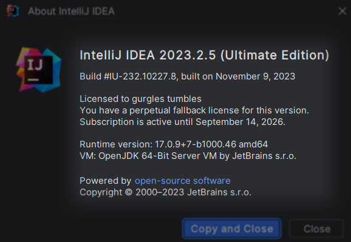

  
  # JetBrains-Activator-PSAutomator
  
  
  

# What is JetBrains-Activator-PSAutomator
This activatory tool, based on JA-NetFilter, features an innovative design that enables automatic configuration adjustments through ***PowerShell***. It offers a seamless integration of JA-NetFilter's robust network filtering capabilities with the versatility and scripting power of PowerShell. This combination results in a user-friendly interface that simplifies complex network configurations, making it ideal for both beginners and advanced users who need to customize network behavior quickly and efficiently.
> The content was partially generated by ChatGPT

> :warning: **If you desire to alter the folder's designation or undertake a different task, please initiate Uninstall.exe prior to proceeding with your subsequent action.**

# Support
- Version: Currently was successfully for the version of 2023.3 

- Product: The activator now supports IDEs as listed below. Future support for additional products will depend on the proper functioning of Ja-Netfilter.
  1. IntelliJ IDEA
  2. PyCharm
  3. CLion
  4. Rider
  5. PhpStorm

# Activation Tutorial
1. Move the folder to a location where it will not be altered.
2. Run the Install.exe and enter the desired number for activation.
3. Input the product key, the website will open upon pressing any key to exit the command line.
4. Launch the IDEs and select Activation Code.
5. Copy the product code from the opened site and paste it into the IDEs' activation dialog.
6. Enjoy!
> If you want get more info, please reference the [source](#Reference)

# Demonstrate
- Activate Process

- Deactivate Process

- IntelliJ IDEA

# Download
[Ｃｌｉｃｋ　Ｈｅｒｅ](https://github.com/Clyde2034/JetBrains-Activator-PSAutomator/releases)

# Reference
1. [https://github.com/libin9iOak/ja-netfilter-all](https://github.com/libin9iOak/ja-netfilter-all)

# Disclaimer
This software and technology are exclusively for academic and research purposes. Commercial application is expressly prohibited. The author disclaims all liability for any losses, risks, or legal disputes arising from commercial use of this software and technology.

The author makes no representations or warranties of any kind, express or implied, as to the completeness, accuracy, reliability, suitability, or timeliness of this software and technology. Any reliance you place on such information is therefore strictly at your own risk. In no event will the author be liable for any loss or damage including without limitation, indirect or consequential loss or damage, arising from the use of this software and technology.

The views, information, or opinions expressed within this software and technology are solely those of the authors and do not necessarily represent those of any affiliated entities.

Unauthorized reverse engineering, decryption, or other forms of tampering with the software and technology are strictly prohibited. Any such unauthorized actions may be deemed as infringement or unlawful conduct, and the author reserves the right to seek legal redress for any infringement.

By using this software and technology, you signify your agreement to be bound by the terms and conditions of this disclaimer. If you disagree with any part of this disclaimer, you must not use this software and technology.
